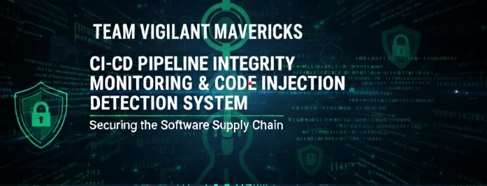

# 🚨 CI/CD Pipeline Integrity & Code Injection Monitoring Tool

An **AI-powered DevSecOps security platform** designed to **detect malicious logic, code injections, and integrity violations inside CI/CD pipelines**—even when the code is **obfuscated, novel, or previously unseen**.

This system **executes user-defined pipeline steps securely**, scans them **before and during execution**, and **blocks malicious pipelines in real time**.

---

## 🧠 Why This Project Exists

Modern CI/CD pipelines are a prime attack surface. Attackers inject:
- Backdoors into build steps
- Cryptominers in CI scripts
- Reverse shells hidden in YAML
- Supply-chain attacks during build time

Traditional security tools **do not analyze pipeline execution logic**.  
This project is built to solve exactly that.

---

## 🎯 Core Capabilities

### 🔍 Pipeline Integrity Monitoring
- Detects unauthorized changes in pipeline configuration
- Flags injected or tampered steps
- Maintains execution history & audit logs

### ⚙️ Pipeline Steps Execution Engine
- Executes **custom user-defined pipeline steps**
- Supports **multi-step pipelines**
- Streams logs in real time via WebSockets
- Immediately stops execution on high-risk detection

### 🧬 AI-Based Malicious Logic Detection (PyGuard)
- Semantic analysis using sentence embeddings
- Detects **intent**, not just signatures
- Resistant to obfuscation & zero-day logic

### 🚫 Pre-Deployment Blocking
- Steps scanned **before execution**
- Commands re-scanned **during runtime**
- Malicious pipelines are blocked instantly

### 📊 Real-Time Dashboard
- Pipeline status (Running / Passed / Blocked)
- Step-by-step execution visibility
- Risk scores & severity classification
- Live logs streaming

---

## ⚙️ Pipeline Steps – Execution Flow

Each pipeline consists of **ordered execution steps**, defined by the user.

### 🧩 Example Pipeline Configuration
```json
{
  "steps": [
    { "name": "Build", "cmd": "npm install && npm run build" },
    { "name": "Test", "cmd": "npm test" },
    { "name": "Dockerize", "cmd": "docker build -t app ." }
  ]
}
```

#### 🧪 Attacks Detected Inside Steps

✔ Obfuscated reverse shells
✔ Base64 / hex encoded payloads
✔ Cryptominers in build commands
✔ curl | bash download attacks
✔ Logic bombs in conditionals
✔ Malicious Dockerfile instructions

### 🏗️ High-Level Architecture
```SCSS
┌──────────────┐      JWT       ┌─────────────────────────┐
│ React Frontend│ ───────────▶ │ Flask Backend             │
│ (Dashboard)   │              │ - Auth (JWT)              │
└──────────────┘              │ - Pipeline Engine          │
                              │ - Step Executor            │
                              │ - ML Scanner (PyGuard)     │
                              │ - Rule Engine              │
                              │ - WebSockets (Logs)        │
                              └──────────────┬────────────┘
                                             │
                                             ▼
                               Secure Step-by-Step Execution
```
### Project Structure
```bash
ai-cicd-security-tool/
│
├── backend/
│   ├── app.py
│   ├── auth/
│   ├── models/
│   ├── ci-integrity/
│   │   ├── train_embeddings.py
│   │   ├── expand_dataset.py
│   │   ├── embeddings/
│   │   └── malicious_samples/
│   ├── utils/
│   │   └── build_runner.py
│   └── reports/
│
├── frontendx/
│   ├── src/
│   ├── pages/
│   ├── components/
│   └── services/
│
└── README.md
```
### Setup Enviroment 
#### Backend
🔹 Set up enviroment and database 
```bash
cd backend
.venv/Scripts/Activate
python app.py
```
#### Frontend
🔹 Set up node modules
```bash
cd frontendx
npm install
```
---


### 🧠 Model Training & Dataset Expansion
🔹 Train Initial Embeddings
```bash
cd backend/ci-integrity/
python train_embeddings.py
```
🔹 Expand Malicious Dataset
```bash
python expand_dataset.py
```
### 🚀 Running the Project
##### Method 1 :
#### Backend
```bash
cd backend
.venv/Scripts/Activate
python app.py
```
#### Frontend
```bash
cd Frontendx
npm run dev 
```

Visit the local host : 
```bash
http://localhost:5173/
```

### 📌 Pipeline Commands 
##### STEP 1: START COMMAND
```bash 
echo === Step 1: Starting Secure Pipeline ===
```
##### STEP 2: REPO CLONING 
```bash 
git clone https://github.com/<username>/<repo>.git repo
```
##### STEP 3 : PYGAURD SCAN 
```bash 
python ci-integrity\pyguard_embedding.py repo --fail-on-high
```
##### STEP 4: VMX SCAN
```bash 
python cicd-integrity-monitor-main\scanner\scanner\cli.py repo
```
##### STEP 1: REMOVE REPO
```bash 
rmdir /s /q repo
```
##### STEP 1:END STAGE
```bash 
echo === ✅ All Scanners Completed ===
```


### 🔐 Security & Isolation

JWT-based authentication
User-specific pipeline isolation
Secure API enforcement
No cross-user pipeline visibility

### 🧪 Why This Tool Is Different
Security Tool	Limitation
SAST	No execution logic
SCA	Ignores CI/CD scripts
Secrets Scan	Misses intent
Policy Gates	Easily bypassed
This Tool	Detects malicious steps

✅ Step-level security
✅ Runtime blocking
✅ AI-driven intent detection
Every command is inspected
Every build is verified before deployment

